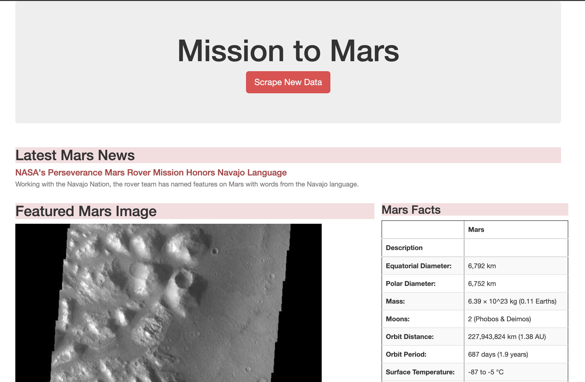
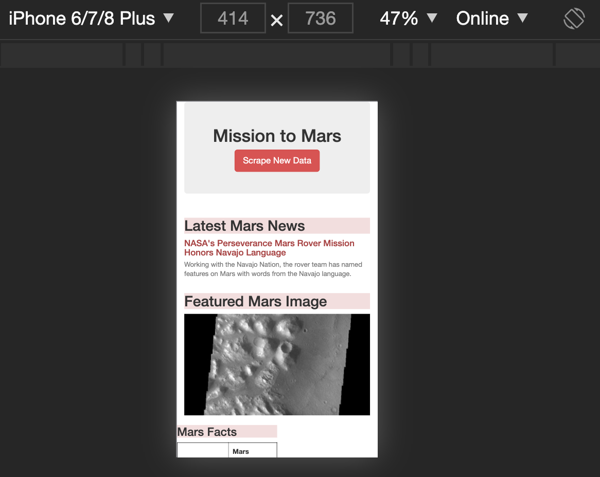

# Mission to Mars

## Overview of Project

### Purpose

Our objective is to automate a web browser to extract data about the "Mission to Mars", store that data in MongoDB, and then display with Flask.

### Resources

- Sites scraped: 
  - [https://mars.nasa.gov/](https://mars.nasa.gov/)
  - [https://astrogeology.usgs.gov/](https://astrogeology.usgs.gov/)
  - [https://data-class-jpl-space.s3.amazonaws.com/JPL_Space/](https://data-class-jpl-space.s3.amazonaws.com/JPL_Space/)
  - [https://space-facts.com/mars/](https://space-facts.com/mars/)
- Software: Python, BeautifulSoup, splinter, MongoDB, Visual Studio Code, flask, pandas

## Project Results

### Data Scraped and Displayed

## Summary

### Additional Bootstrap Customizations

I tried to follow a theme of "The Red Planet" by making the following adjustments:

1. I changed the button to a reddish color by adding `btn-danger` to the class attribute.

2. To help visually separate sections of the webpage I changed the `<h2>` and `<h3>` tags to have a reddish background by adding `bg-danger` to the class attribute.

3. To get the most recent headline to stick out I changed its text color to a reddish color by adding `text-danger` to the `<h5>` class attribute and graying the text below by adding `text-muted` to the `
` class attribute.

4. I also added `
` and other `col-xs` values to make the webpage mobile compatible:
